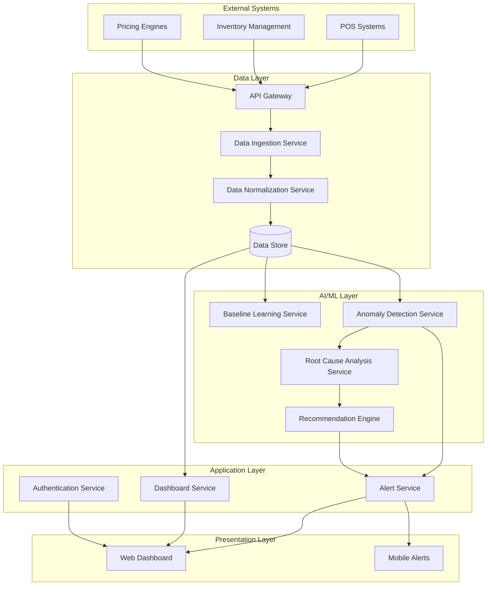

# Design Document: Retail Sentinel AI

## Overview

Retail Sentinel AI is a comprehensive anomaly detection platform that monitors retail operations in real-time using advanced AI and machine learning techniques. The system ingests data from multiple retail systems (POS, Inventory Management, Pricing Engines), establishes baseline behavioral patterns, detects deviations, performs root cause analysis, and provides actionable recommendations to prevent revenue loss.

The platform employs a microservices architecture with event-driven communication, enabling scalability and maintainability. The core AI engine uses ensemble methods combining statistical techniques (Isolation Forest, Z-score analysis) with time-series analysis (ARIMA, seasonal decomposition) to achieve robust anomaly detection with minimal false positives.

## Architecture

### High-Level Architecture



### Deployment Architecture

The system will be deployed on AWS using a containerized microservices approach:

- **API Gateway**: AWS API Gateway for external system integration
- **Compute**: ECS Fargate for containerized services
- **Storage**: PostgreSQL RDS for structured data, S3 for raw data and models
- **Streaming**: Kinesis Data Streams for real-time data processing
- **ML Platform**: SageMaker for model training and inference
- **Monitoring**: CloudWatch for system monitoring and alerting
- **Security**: IAM for access control, Secrets Manager for credentials

## Components and Interfaces

### Data Ingestion Engine

**Purpose**: Collects and preprocesses data from external retail systems.

**Key Components**:
- **API Connectors**: Adapters for different retail system APIs (REST, GraphQL, SOAP)
- **Data Validators**: Ensure data quality and completeness
- **Rate Limiters**: Manage API call frequency to avoid overwhelming source systems
- **Error Handlers**: Implement retry logic with exponential backoff

**Interfaces**:
```python
class DataIngestionEngine:
    def ingest_pos_data(self, store_id: str, timestamp_range: TimeRange) -> List[POSTransaction]
    def ingest_inventory_data(self, store_id: str, timestamp_range: TimeRange) -> List[InventoryRecord]
    def ingest_pricing_data(self, store_id: str, timestamp_range: TimeRange) -> List[PricingRecord]
    def validate_data_quality(self, data: Any) -> ValidationResult
    def normalize_data_format(self, raw_data: Any, source_type: str) -> NormalizedData
```

### Baseline Learning Service

**Purpose**: Establishes normal operational patterns using historical data.

**Key Components**:
- **Pattern Analyzers**: Statistical analysis of historical trends
- **Seasonal Decomposition**: Identifies cyclical patterns (daily, weekly, monthly)
- **Feature Engineering**: Creates relevant features for anomaly detection
- **Model Training Pipeline**: Automated retraining based on new data

**ML Algorithms**:
- **Isolation Forest**: For multivariate anomaly detection
- **Local Outlier Factor (LOF)**: For density-based anomaly detection
- **ARIMA Models**: For time-series forecasting and deviation detection
- **Seasonal-Trend Decomposition**: For handling cyclical business patterns

**Interfaces**:
```python
class BaselineLearningService:
    def train_baseline_model(self, historical_data: DataFrame, store_id: str) -> BaselineModel
    def update_baseline(self, new_data: DataFrame, existing_model: BaselineModel) -> BaselineModel
    def detect_seasonal_patterns(self, time_series_data: DataFrame) -> SeasonalPatterns
    def calculate_confidence_intervals(self, model: BaselineModel, confidence_level: float) -> ConfidenceIntervals
```

### Anomaly Detection Engine

**Purpose**: Identifies deviations from established baselines in real-time.

**Key Components**:
- **Real-time Processors**: Stream processing for incoming data
- **Ensemble Detectors**: Combines multiple detection algorithms
- **Severity Classifiers**: Assigns importance levels to detected anomalies
- **False Positive Reducers**: Adaptive learning to minimize false alarms

**Detection Strategies**:
- **Statistical Methods**: Z-score, modified Z-score, IQR-based detection
- **Machine Learning**: Isolation Forest, One-Class SVM, Autoencoders
- **Time Series**: ARIMA residual analysis, seasonal decomposition
- **Business Rules**: Domain-specific thresholds and constraints

**Interfaces**:
```python
class AnomalyDetectionEngine:
    def detect_anomalies(self, current_data: DataFrame, baseline_model: BaselineModel) -> List[Anomaly]
    def classify_severity(self, anomaly: Anomaly, business_context: BusinessContext) -> SeverityLevel
    def group_related_anomalies(self, anomalies: List[Anomaly]) -> List[AnomalyGroup]
    def update_false_positive_patterns(self, feedback: UserFeedback) -> None
```

### Root Cause Analysis Service

**Purpose**: Correlates data across systems to identify underlying causes of anomalies.

**Key Components**:
- **Correlation Engine**: Identifies relationships between different data streams
- **Causal Inference**: Determines likely cause-effect relationships
- **Context Enrichment**: Adds business context (promotions, events, holidays)
- **Explanation Generator**: Creates human-readable explanations

**Analysis Techniques**:
- **Cross-correlation Analysis**: Identifies time-lagged relationships
- **Granger Causality**: Tests for causal relationships in time series
- **Association Rule Mining**: Discovers frequent patterns in anomaly co-occurrence
- **Graph-based Analysis**: Models system dependencies and propagation paths

**Interfaces**:
```python
class RootCauseAnalysisService:
    def analyze_root_cause(self, anomaly: Anomaly, context_data: ContextData) -> RootCauseAnalysis
    def correlate_cross_system_data(self, anomaly_timestamp: datetime, systems: List[str]) -> CorrelationResult
    def generate_explanation(self, root_cause: RootCauseAnalysis, user_role: UserRole) -> Explanation
    def rank_potential_causes(self, causes: List[PotentialCause]) -> List[RankedCause]
```

### Action Recommendation Engine

**Purpose**: Generates specific, actionable recommendations for addressing detected anomalies.

**Key Components**:
- **Action Library**: Database of proven corrective actions
- **Impact Estimators**: Predict effectiveness of different actions
- **Feasibility Assessors**: Evaluate practicality of recommendations
- **Learning System**: Improves recommendations based on outcomes

**Recommendation Strategies**:
- **Rule-based Recommendations**: Pre-defined actions for known anomaly types
- **Case-based Reasoning**: Leverage similar historical situations
- **Optimization Models**: Multi-objective optimization for action selection
- **Reinforcement Learning**: Learn optimal actions through feedback

**Interfaces**:
```python
class ActionRecommendationEngine:
    def generate_recommendations(self, root_cause: RootCauseAnalysis, constraints: ActionConstraints) -> List[Recommendation]
    def estimate_impact(self, recommendation: Recommendation, current_state: SystemState) -> ImpactEstimate
    def prioritize_actions(self, recommendations: List[Recommendation]) -> List[PrioritizedRecommendation]
    def track_outcome(self, recommendation: Recommendation, actual_outcome: Outcome) -> None
```

### Alert and Notification System

**Purpose**: Delivers timely, relevant notifications to appropriate users based on their roles and responsibilities.

**Key Components**:
- **Notification Router**: Determines recipients based on anomaly type and severity
- **Channel Manager**: Supports multiple delivery channels (email, SMS, push, dashboard)
- **Escalation Engine**: Implements escalation policies for unacknowledged alerts
- **Template Engine**: Customizes message content for different user roles

**Interfaces**:
```python
class AlertNotificationSystem:
    def send_alert(self, anomaly: Anomaly, recommendations: List[Recommendation], recipients: List[User]) -> AlertResult
    def escalate_unacknowledged_alert(self, alert_id: str, escalation_policy: EscalationPolicy) -> None
    def customize_message(self, alert_template: AlertTemplate, user_role: UserRole, context: AlertContext) -> CustomizedAlert
    def track_alert_acknowledgment(self, alert_id: str, user_id: str, timestamp: datetime) -> None
```

## Data Models

### Core Data Structures

```python
@dataclass
class POSTransaction:
    transaction_id: str
    store_id: str
    timestamp: datetime
    items: List[TransactionItem]
    total_amount: Decimal
    payment_method: str
    cashier_id: str
    customer_id: Optional[str]

@dataclass
class InventoryRecord:
    store_id: str
    product_id: str
    timestamp: datetime
    quantity_on_hand: int
    quantity_reserved: int
    last_restock_date: datetime
    reorder_point: int

@dataclass
class PricingRecord:
    store_id: str
    product_id: str
    timestamp: datetime
    regular_price: Decimal
    sale_price: Optional[Decimal]
    promotion_id: Optional[str]
    effective_date: datetime
    expiration_date: Optional[datetime]

@dataclass
class Anomaly:
    anomaly_id: str
    store_id: str
    detection_timestamp: datetime
    anomaly_type: AnomalyType
    severity: SeverityLevel
    affected_metrics: List[str]
    deviation_score: float
    confidence_level: float
    raw_data: Dict[str, Any]
    baseline_expectation: Dict[str, Any]

@dataclass
class RootCauseAnalysis:
    anomaly_id: str
    primary_cause: PotentialCause
    contributing_factors: List[ContributingFactor]
    confidence_score: float
    correlation_data: CorrelationMatrix
    business_context: BusinessContext
    explanation: str

@dataclass
class Recommendation:
    recommendation_id: str
    anomaly_id: str
    action_type: ActionType
    description: str
    priority: Priority
    estimated_impact: ImpactEstimate
    implementation_effort: EffortLevel
    prerequisites: List[str]
    expected_outcome: str
```

### Database Schema

**Anomalies Table**:
```sql
CREATE TABLE anomalies (
    anomaly_id UUID PRIMARY KEY,
    store_id VARCHAR(50) NOT NULL,
    detection_timestamp TIMESTAMP WITH TIME ZONE NOT NULL,
    anomaly_type VARCHAR(50) NOT NULL,
    severity VARCHAR(20) NOT NULL,
    deviation_score DECIMAL(10,6) NOT NULL,
    confidence_level DECIMAL(5,4) NOT NULL,
    status VARCHAR(20) DEFAULT 'ACTIVE',
    acknowledged_by VARCHAR(100),
    acknowledged_at TIMESTAMP WITH TIME ZONE,
    resolved_at TIMESTAMP WITH TIME ZONE,
    raw_data JSONB,
    baseline_expectation JSONB,
    created_at TIMESTAMP WITH TIME ZONE DEFAULT NOW(),
    updated_at TIMESTAMP WITH TIME ZONE DEFAULT NOW()
);
```

**Root Cause Analysis Table**:
```sql
CREATE TABLE root_cause_analyses (
    analysis_id UUID PRIMARY KEY,
    anomaly_id UUID REFERENCES anomalies(anomaly_id),
    primary_cause VARCHAR(200) NOT NULL,
    confidence_score DECIMAL(5,4) NOT NULL,
    correlation_data JSONB,
    business_context JSONB,
    explanation TEXT,
    created_at TIMESTAMP WITH TIME ZONE DEFAULT NOW()
);
```

**Recommendations Table**:
```sql
CREATE TABLE recommendations (
    recommendation_id UUID PRIMARY KEY,
    anomaly_id UUID REFERENCES anomalies(anomaly_id),
    action_type VARCHAR(50) NOT NULL,
    description TEXT NOT NULL,
    priority VARCHAR(20) NOT NULL,
    estimated_impact JSONB,
    implementation_effort VARCHAR(20),
    status VARCHAR(20) DEFAULT 'PENDING',
    implemented_by VARCHAR(100),
    implemented_at TIMESTAMP WITH TIME ZONE,
    outcome_feedback JSONB,
    created_at TIMESTAMP WITH TIME ZONE DEFAULT NOW()
);
```

## Error Handling

### Error Classification and Response Strategies

**Data Ingestion Errors**:
- **Connection Failures**: Implement exponential backoff retry with circuit breaker pattern
- **Data Quality Issues**: Log warnings, attempt data cleaning, flag for manual review
- **Rate Limiting**: Implement adaptive throttling and queue management
- **Schema Changes**: Graceful degradation with notification to administrators

**ML Model Errors**:
- **Model Drift**: Automatic retraining triggers when performance degrades
- **Prediction Failures**: Fallback to statistical methods or previous model versions
- **Resource Constraints**: Auto-scaling with performance monitoring
- **Training Failures**: Rollback to previous model with administrator notification

**System Integration Errors**:
- **API Failures**: Retry logic with exponential backoff and dead letter queues
- **Database Errors**: Connection pooling with failover to read replicas
- **Authentication Errors**: Token refresh with secure credential management
- **Network Issues**: Timeout handling with graceful degradation

### Error Recovery Mechanisms

```python
class ErrorHandler:
    def handle_data_ingestion_error(self, error: DataIngestionError) -> RecoveryAction
    def handle_model_prediction_error(self, error: ModelError) -> FallbackStrategy
    def handle_system_integration_error(self, error: IntegrationError) -> RetryPolicy
    def log_error_for_analysis(self, error: SystemError, context: ErrorContext) -> None
```

## Testing Strategy

### Dual Testing Approach

The testing strategy employs both unit testing and property-based testing to ensure comprehensive coverage and correctness validation.

**Unit Testing Focus**:
- Specific examples demonstrating correct behavior
- Edge cases and error conditions
- Integration points between components
- Business rule validation with known scenarios

**Property-Based Testing Focus**:
- Universal properties that hold across all inputs
- Comprehensive input coverage through randomization
- Invariant validation across system transformations
- Robustness testing with generated edge cases

### Testing Framework Selection

**Backend Testing**:
- **Unit Tests**: pytest for Python services
- **Property Tests**: Hypothesis for Python property-based testing
- **Integration Tests**: pytest with testcontainers for database testing
- **API Tests**: pytest with requests for endpoint testing

**Frontend Testing**:
- **Unit Tests**: Jest for React components
- **Integration Tests**: React Testing Library
- **End-to-End Tests**: Playwright for user workflow testing

**ML Model Testing**:
- **Model Validation**: scikit-learn model evaluation metrics
- **Data Drift Detection**: evidently for monitoring data quality
- **Property Tests**: Hypothesis for model invariant testing

### Property-Based Test Configuration

- **Minimum Iterations**: 100 per property test (due to randomization)
- **Test Tagging**: Each property test references its design document property
- **Tag Format**: **Feature: retail-sentinel-ai, Property {number}: {property_text}**
- **Coverage Requirements**: Each correctness property implemented by a single property-based test

## Correctness Properties

*A property is a characteristic or behavior that should hold true across all valid executions of a system—essentially, a formal statement about what the system should do. Properties serve as the bridge between human-readable specifications and machine-verifiable correctness guarantees.*

Based on the requirements analysis, the following correctness properties ensure the system behaves correctly across all valid inputs and scenarios:

### Property 1: Data Collection Completeness
*For any* available retail data from POS, Inventory Management, or Pricing Engine systems, the Data Ingestion Engine should successfully collect the data in real time without loss.
**Validates: Requirements 1.1, 1.2, 1.3**

### Property 2: Data Preprocessing Integrity
*For any* raw retail data that is ingested, preprocessing should produce normalized output while maintaining data integrity and traceability to the original input.
**Validates: Requirements 1.4, 1.5**

### Property 3: Error Recovery Consistency
*For any* data ingestion failure, the system should log the error and implement retry logic with exponential backoff according to configured policies.
**Validates: Requirements 1.6**

### Property 4: Baseline Learning Convergence
*For any* sufficient historical retail data, the Baseline Model should establish statistically confident normal behavior patterns that incorporate seasonal and cyclical variations.
**Validates: Requirements 2.1, 2.3, 2.4**

### Property 5: Baseline Adaptation Continuity
*For any* new data processed after baseline establishment, the model should continuously update its understanding while maintaining statistical validity.
**Validates: Requirements 2.2**

### Property 6: Model Performance Monitoring
*For any* degradation in model performance below configured thresholds, the system should automatically trigger retraining procedures.
**Validates: Requirements 2.5**

### Property 7: Anomaly Detection Accuracy
*For any* incoming data that deviates from established baselines beyond configured thresholds, the Anomaly Detection Engine should identify it as an anomaly with appropriate severity classification.
**Validates: Requirements 3.1, 3.2**

### Property 8: Real-time Processing Performance
*For any* detected anomaly, the system should complete processing and classification within 30 seconds of data ingestion.
**Validates: Requirements 3.3**

### Property 9: Adaptive Learning Effectiveness
*For any* false positive feedback provided by users, the system should adapt its detection algorithms to reduce similar false positives in future analysis.
**Validates: Requirements 3.4**

### Property 10: Anomaly Grouping Logic
*For any* set of related anomalies occurring within a defined time window, the system should group them for consolidated analysis based on correlation patterns.
**Validates: Requirements 3.5**

### Property 11: Cross-system Root Cause Correlation
*For any* detected anomaly, the Root Cause Analyzer should examine data across multiple systems (inventory, promotions, sales) to identify potential causes with confidence scoring.
**Validates: Requirements 4.1, 4.2**

### Property 12: Cause Ranking Consistency
*For any* root cause analysis with multiple potential causes, the system should rank them by likelihood and impact using consistent scoring criteria.
**Validates: Requirements 4.3**

### Property 13: Explanation Clarity
*For any* root cause analysis or recommendation, explanations should use business terminology and avoid technical jargon to ensure user comprehension.
**Validates: Requirements 4.4, 12.2, 12.5**

### Property 14: Uncertainty Communication
*For any* analysis with insufficient data or low confidence, the system should clearly indicate uncertainty and suggest additional data sources or validation steps.
**Validates: Requirements 4.5, 12.3**

### Property 15: Recommendation Generation Completeness
*For any* completed root cause analysis, the Action Recommendation Engine should generate specific, prioritized corrective actions with impact estimates and feasibility assessments.
**Validates: Requirements 5.1, 5.2**

### Property 16: Alternative Action Presentation
*For any* scenario with multiple viable action options, the system should present alternatives with clear trade-off analysis to support decision-making.
**Validates: Requirements 5.3**

### Property 17: Outcome Tracking and Learning
*For any* implemented recommendation, the system should track outcomes and use results to improve future recommendation quality.
**Validates: Requirements 5.4**

### Property 18: Urgent Scenario Response
*For any* urgent anomaly detection, the system should provide both immediate short-term actions and strategic long-term action plans.
**Validates: Requirements 5.5**

### Property 19: Role-based Alert Routing
*For any* detected anomaly, the Alert System should notify appropriate users based on severity level and user role, with escalation for unacknowledged critical alerts within 15 minutes.
**Validates: Requirements 6.1, 6.6**

### Property 20: Role-specific Alert Content
*For any* alert sent to users, the content should be customized based on the recipient's role (Store Manager, Operations Team, IT Team, or Leadership) with relevant information and appropriate detail level.
**Validates: Requirements 6.2, 6.3, 6.4, 6.5**

### Property 21: Dashboard Real-time Display
*For any* user accessing the Operations Dashboard, it should display current system status, active anomalies with severity levels, affected systems, and time since detection.
**Validates: Requirements 7.1, 7.2**

### Property 22: Historical Analysis Capabilities
*For any* request for historical data, the dashboard should provide trend analysis, pattern visualization, and drill-down capabilities for detailed anomaly exploration.
**Validates: Requirements 7.3, 7.4**

### Property 23: Dashboard Auto-refresh Functionality
*For any* dashboard session, data should refresh automatically without user intervention, supporting both individual store and aggregate multi-store views.
**Validates: Requirements 7.5, 7.6**

### Property 24: Authentication and Authorization Enforcement
*For any* system access attempt, users must be authenticated with secure credentials and authorized based on their assigned role before accessing features.
**Validates: Requirements 8.1, 8.2**

### Property 25: Role-based Data Access Control
*For any* authenticated user, data access should be restricted according to their role: Store Managers see only their store data, Operations Team gets system-wide access, IT Team gets technical diagnostics, and Leadership gets high-level analytics.
**Validates: Requirements 8.3, 8.4, 8.5, 8.6**

### Property 26: Session Security Management
*For any* user session inactive for 30 minutes, the system should automatically terminate the session for security purposes.
**Validates: Requirements 8.7**

### Property 27: Scalability and Performance Maintenance
*For any* increase in connected stores, data volume, or system load, the platform should maintain performance standards including anomaly detection response times under 30 seconds and system availability above 99.5%.
**Validates: Requirements 9.1, 9.2, 9.3, 9.5**

### Property 28: Seamless Store Onboarding
*For any* new store addition, the onboarding process should complete without disrupting existing store operations or system performance.
**Validates: Requirements 9.4**

### Property 29: Data Storage and Retrieval Performance
*For any* retail data processed, it should be stored securely with backups, and historical data retrieval should complete within 5 seconds for standard queries.
**Validates: Requirements 10.1, 10.2**

### Property 30: Data Lifecycle Management
*For any* data subject to retention policies, the system should automatically archive or delete data according to configured schedules while maintaining audit trails for compliance.
**Validates: Requirements 10.3, 10.5**

### Property 31: Data Integrity and Recovery
*For any* detected data corruption, the system should automatically restore from backups and alert administrators with detailed recovery information.
**Validates: Requirements 10.4**

### Property 32: API Integration Reliability
*For any* external system integration, the platform should use standard protocols with proper authentication, implement retry logic and failover for connection failures, and normalize varying data formats while preserving semantic meaning.
**Validates: Requirements 11.1, 11.2, 11.3**

### Property 33: Schema Adaptation and Error Handling
*For any* schema changes in connected systems or integration errors, the platform should adapt automatically where possible and log detailed error information for troubleshooting.
**Validates: Requirements 11.4, 11.5**

### Property 34: AI Explainability and Transparency
*For any* anomaly detection or model decision, the system should provide clear explanations, and when questioned, offer detailed feature importance and decision pathways to support user understanding and trust.
**Validates: Requirements 12.1, 12.4**

## Testing Strategy

### Dual Testing Approach

The Retail Sentinel AI platform requires both unit testing and property-based testing to ensure comprehensive coverage and correctness validation.

**Unit Testing Focus**:
- Specific examples demonstrating correct behavior for known scenarios
- Edge cases and error conditions in data processing and ML pipelines
- Integration points between microservices and external systems
- Business rule validation with predefined test cases
- API endpoint testing with known inputs and expected outputs

**Property-Based Testing Focus**:
- Universal properties that hold across all valid inputs and system states
- Comprehensive input coverage through randomized data generation
- Invariant validation across system transformations and data processing
- Robustness testing with generated edge cases and boundary conditions
- ML model behavior validation across diverse input distributions

### Testing Framework Configuration

**Backend Services (Python/FastAPI)**:
- **Unit Tests**: pytest for service testing with fixtures and mocks
- **Property Tests**: Hypothesis for property-based testing with minimum 100 iterations per test
- **Integration Tests**: pytest with testcontainers for database and external service testing
- **API Tests**: pytest with httpx for endpoint testing

**Machine Learning Components**:
- **Model Validation**: scikit-learn metrics and cross-validation
- **Data Quality**: Great Expectations for data validation pipelines
- **Property Tests**: Hypothesis for ML model invariant testing
- **Performance Tests**: Custom benchmarking for real-time processing requirements

**Frontend (React)**:
- **Unit Tests**: Jest and React Testing Library for component testing
- **Integration Tests**: Testing Library for user interaction flows
- **End-to-End Tests**: Playwright for complete user workflow validation

**Property-Based Test Requirements**:
- **Minimum Iterations**: 100 per property test to ensure statistical confidence
- **Test Tagging**: Each property test must reference its design document property
- **Tag Format**: **Feature: retail-sentinel-ai, Property {number}: {property_text}**
- **Coverage Mapping**: Each correctness property implemented by exactly one property-based test
- **Failure Analysis**: Property test failures must include shrinking to minimal failing examples

**Integration and System Testing**:
- **End-to-End Workflows**: Complete data ingestion through alert generation
- **Performance Testing**: Load testing with realistic retail data volumes
- **Chaos Engineering**: Fault injection to validate error handling and recovery
- **Security Testing**: Authentication, authorization, and data protection validation

The testing strategy ensures that both specific known scenarios (unit tests) and general system behavior (property tests) are thoroughly validated, providing confidence in system correctness and reliability across all operational conditions.